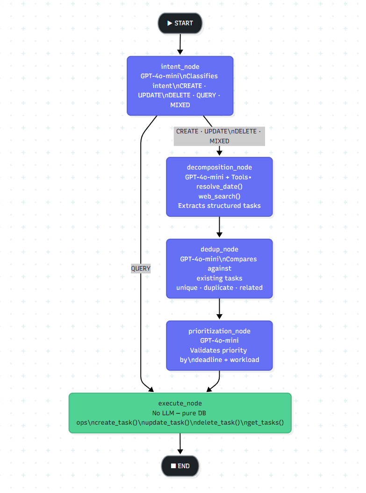

# Thought2Do — Technical Documentation

> **Think it. Say it. Done.**
>
> An agentic, voice-driven task management system powered by a multi-stage LangGraph pipeline, OpenAI Whisper, GPT-4o-mini, FastAPI, and Streamlit.

---

*Thought2Do — Technical Documentation*

**Project Done By: Yohan Markose**

## Table of Contents

1. [System Architecture](#1-system-architecture)
2. [Implementation Details](#2-implementation-details)
3. [Performance Metrics](#3-performance-metrics)
4. [Challenges and Solutions](#4-challenges-and-solutions)
5. [Future Improvements](#5-future-improvements)
6. [Ethical Considerations](#6-ethical-considerations)

---

## 1. System Architecture

### 1.1 High-Level Overview

Thought2Do is a two-service system: a FastAPI backend that owns all business logic and AI orchestration, and a Streamlit frontend that provides the user interface. They communicate over HTTP with JWT-authenticated requests.

```
┌─────────────────────────────────────────────────────────────────────┐
│                        USER'S BROWSER                               │
│                                                                     │
│   [Microphone / Keyboard]  →  Streamlit Frontend (:8501)           │
└────────────────────────────────────┬────────────────────────────────┘
                                     │ HTTPS  Bearer JWT
                                     ▼
┌────────────────────────────────────────────────────────────────────┐
│                    FASTAPI BACKEND (:8000)                         │
│                                                                    │
│  ┌──────────────┐  ┌──────────────┐  ┌──────────────────────────┐ │
│  │ /auth/*      │  │ /tasks/*     │  │ /voice/*                 │ │
│  │ Register     │  │ CRUD         │  │ /transcribe  /process    │ │
│  │ Login        │  │ Filter       │  │                          │ │
│  │ Me           │  │ Sort         │  │                          │ │
│  └──────┬───────┘  └──────┬───────┘  └──────────┬───────────────┘ │
│         │                 │                      │                 │
│  ┌──────▼───────────────────────────────────────▼──────────────┐  │
│  │               Services Layer                                 │  │
│  │  auth_service   task_service   voice_service  vector_service │  │
│  └──────┬──────────────┬───────────────┬──────────────────────-┘  │
│         │              │               │                           │
│  ┌──────▼──────┐  ┌────▼────┐  ┌──────▼──────────────────────┐   │
│  │ passlib/JWT │  │ MongoDB │  │  LangGraph Multi-Agent       │   │
│  │             │  │ (Motor) │  │  Pipeline                    │   │
│  └─────────────┘  └────┬────┘  └──────────────────────────────┘   │
│                        │                                           │
└────────────────────────┼───────────────────────────────────────────┘
                         │
          ┌──────────────┼──────────────┐
          ▼              ▼              ▼
    ┌──────────┐  ┌────────────┐  ┌──────────────┐
    │ MongoDB  │  │ OpenAI     │  │ DuckDuckGo   │
    │  Atlas   │  │ Whisper +  │  │ Web Search   │
    │ (cloud)  │  │ GPT-4o-mini│  │ (ddgs)       │
    └──────────┘  └────────────┘  └──────────────┘
```

### 1.2 Multi-Agent Pipeline Architecture

The core intelligence is a LangGraph `StateGraph` that passes a shared `AgentState` dict through five sequential nodes. Intent classification acts as a router — QUERY intents short-circuit to the execute node, skipping decomposition, deduplication, and prioritization.

```
                         ┌─────────────────────────┐
                         │  process_voice_input()   │
                         │  - Fetch existing tasks  │
                         │  - Build initial state   │
                         └──────────┬──────────────┘
                                    │
                                    ▼
                         ┌──────────────────────┐
                         │    intent_node        │
                         │  GPT-4o-mini          │
                         │  → CREATE / UPDATE /  │
                         │    DELETE / QUERY /   │
                         │    MIXED              │
                         └──────────┬────────────┘
                                    │
                        ┌───────────┴────────────┐
                        │                        │
                   [QUERY]                  [ALL OTHER]
                        │                        │
                        │              ┌──────────▼──────────┐
                        │              │  decomposition_node  │
                        │              │  GPT-4o-mini         │
                        │              │  Tools:              │
                        │              │  • resolve_date()    │
                        │              │  • web_search()      │
                        │              │  → Structured tasks  │
                        │              └──────────┬───────────┘
                        │                         │
                        │              ┌──────────▼──────────┐
                        │              │    dedup_node        │
                        │              │  GPT-4o-mini         │
                        │              │  → unique/duplicate/ │
                        │              │    related + action  │
                        │              └──────────┬───────────┘
                        │                         │
                        │              ┌──────────▼──────────┐
                        │              │ prioritization_node  │
                        │              │  GPT-4o-mini         │
                        │              │  → Validated         │
                        │              │    priorities        │
                        │              └──────────┬───────────┘
                        │                         │
                        └──────────┬──────────────┘
                                   │
                         ┌─────────▼────────────┐
                         │    execute_node       │
                         │  (no LLM)            │
                         │  create_task()        │
                         │  update_task()        │
                         │  delete_task()        │
                         │  get_tasks()          │
                         └─────────┬─────────────┘
                                   │
                         ┌─────────▼────────────┐
                         │    summary_node       │
                         │  GPT-4o-mini          │
                         │  → Natural-language   │
                         │    reply + suggestions│
                         └─────────┬─────────────┘
                                   │
                                  END
```

### 1.2a LangGraph Wiring (Mermaid)

The exact graph wiring as compiled in `agents/graph.py`:



**Graph definition (from `agents/graph.py`):**

```python
workflow = StateGraph(AgentState)

# Nodes
workflow.add_node("intent",         intent_node)
workflow.add_node("decomposition",  decomposition_node)
workflow.add_node("dedup",          dedup_node)
workflow.add_node("prioritization", prioritization_node)
workflow.add_node("execute",        _make_execute_node(db))

# Edges
workflow.add_edge(START, "intent")
workflow.add_conditional_edges(
    "intent",
    _route_after_intent,          # QUERY → "execute", else → "decomposition"
    {"decomposition": "decomposition", "execute": "execute"}
)
workflow.add_edge("decomposition",  "dedup")
workflow.add_edge("dedup",          "prioritization")
workflow.add_edge("prioritization", "execute")
workflow.add_edge("execute",        END)

graph = workflow.compile()
```

The conditional edge after `intent_node` is the key routing decision. `_route_after_intent()` reads `state["intent"]` and returns the string `"execute"` for QUERY (bypassing three LLM calls) or `"decomposition"` for everything else.

### 1.3 Frontend Page Structure

```
frontend/
├── app.py                  Landing page (unauthenticated) + authenticated shell
├── pages/
│   ├── 1_Dashboard.py      Read/organize: task list grouped by priority/category/time
│   ├── 2_Assistant.py      Primary interface: chat + voice → pipeline execution
│   ├── 3_Demo.py           Pipeline transparency: shows per-agent reasoning
│   └── 4_Settings.py       Profile, appearance, data export, task defaults
├── components/
│   ├── task_card.py        Priority-bordered expandable task cards
│   ├── sidebar.py          Filters, stats, theme toggle, logout
│   ├── voice_recorder.py   st.audio_input wrapper with reset-counter trick
│   └── auth_forms.py       Login + register forms
└── utils/
    ├── api_client.py        APIClient class (all backend endpoints)
    ├── theme.py             Dark/light palettes + CSS generator
    └── page.py              Shared auth gate + theme injection
```

### 1.4 Data Models

#### Task Document (MongoDB `tasks` collection)
| Field | Type | Notes |
|---|---|---|
| `_id` | ObjectId | Auto-generated |
| `user_id` | string | FK to users._id |
| `title` | string | Required |
| `description` | string \| null | AI-enriched via web_search |
| `category` | enum | Work / Personal / Health / Finance / Education / General |
| `priority` | enum | Critical / High / Medium / Low |
| `deadline` | datetime \| null | ISO 8601; null if not mentioned |
| `status` | enum | pending / in_progress / completed / cancelled |
| `tags` | string[] | AI-inferred or user-supplied |
| `parent_task_id` | string \| null | Reserved for subtasks |
| `source` | enum | voice / manual / decomposed |
| `created_at` | datetime | UTC |
| `updated_at` | datetime | UTC |

#### AgentState (LangGraph shared state)
| Field | Type | Populated By |
|---|---|---|
| `transcript` | string | process_voice_input() |
| `user_id` | string | process_voice_input() |
| `existing_tasks` | list[dict] | process_voice_input() |
| `intent` | string | intent_node |
| `extracted_tasks` | list[dict] | decomposition_node |
| `dedup_results` | list[dict] | dedup_node |
| `final_tasks` | list[dict] | prioritization_node |
| `actions_taken` | list[dict] | execute_node |
| `reasoning_log` | list[str] | all nodes (append-only) |
| `current_datetime` | string | process_voice_input() |
| `error` | string \| null | any failing node |
| `summary` | string | summary_node |
| `suggestions` | list[str] | summary_node |

---

## 2. Implementation Details

### 2.1 Multi-Agent Orchestration (LangGraph)

The pipeline uses LangGraph's `StateGraph` with typed state (`AgentState` TypedDict). Each node is an async function with the signature `async def node(state: AgentState) -> dict` — it returns only the keys it modifies, and LangGraph merges the partial update into the full state.

**Routing logic:** After `intent_node`, a conditional edge function reads `state["intent"]`. A `QUERY` intent bypasses three expensive LLM calls (decomposition, dedup, prioritization) and goes directly to the execute node, which runs `get_tasks()` with the user's current filters. This pattern keeps query responses fast (one LLM call instead of four).

```python
def _route_after_intent(state: AgentState) -> str:
    if state.get("error"):
        return "execute"
    return "execute" if state.get("intent") == "QUERY" else "decomposition"
```

**Graph compilation:** The graph is compiled once per request via `workflow.compile()`. LangGraph's compilation step validates edge connectivity and builds the execution plan; subsequent `ainvoke()` calls on the compiled graph are lightweight.

### 2.2 Tool-Calling in the Decomposition Agent

The decomposition agent uses LangChain's function-calling loop to invoke two tools:

**`resolve_date(phrase, anchor_iso)`** — Uses the `parsedatetime` library to parse natural-language expressions against a supplied anchor date. This avoids hallucination: "this Friday" is resolved to a specific ISO timestamp by a deterministic algorithm, not by asking the LLM to guess. The agent passes `current_datetime` from state as the anchor.

**`web_search(query, max_results=5)`** — Uses the `ddgs` (DuckDuckGo) library to fetch real-time search results. The agent uses this to enrich task descriptions with actionable prep tips. For example, "prepare for dentist appointment" triggers a search and the results are folded into the task description as bullet points.

The tool loop runs up to 8 iterations: the LLM calls a tool, the result is fed back as a `ToolMessage`, and the LLM continues reasoning. This allows multi-step date resolution (e.g., a compound utterance with three dates) within a single agent invocation.

Tools are synchronous functions wrapped with `asyncio.to_thread()` inside the async agent, keeping the event loop non-blocking.

### 2.3 LLM Invocation and Retry Logic

All LLM calls go through `invoke_json()` in `agents/__init__.py`:

1. Build messages (system prompt + user message)
2. Call `ChatOpenAI(model="gpt-4o-mini", temperature=0).ainvoke(messages)`
3. Strip markdown code fences from response
4. Attempt `json.loads()`
5. On parse failure: retry once with the same input
6. On second failure: raise `RuntimeError`

A 30-second `asyncio.wait_for` timeout wraps every LLM call. This prevents a single slow API response from blocking the entire request indefinitely.

`temperature=0` is used for all agents. Task management requires deterministic, predictable outputs — creative variation is undesirable here.

### 2.4 MongoDB Query Design

Task listing uses a MongoDB aggregation pipeline rather than a simple `find()`. This enables precise composite sorting:

```python
[
  {"$addFields": {
    "_priority_rank": {"$switch": {
      "branches": [
        {"case": {"$eq": ["$priority", "Critical"]}, "then": 0},
        {"case": {"$eq": ["$priority", "High"]},     "then": 1},
        {"case": {"$eq": ["$priority", "Medium"]},   "then": 2},
        {"case": {"$eq": ["$priority", "Low"]},      "then": 3},
      ],
      "default": 4
    }},
    "_has_deadline": {"$cond": [{"$gt": ["$deadline", None]}, 0, 1]}
  }},
  {"$sort": {"_priority_rank": 1, "_has_deadline": 1, "deadline": 1, "created_at": -1}},
  {"$skip": skip},
  {"$limit": limit}
]
```

This sorts tasks: Critical before High before Medium before Low; within same priority, tasks with deadlines before tasks without; within same deadline presence, earlier deadlines first; ties broken by creation date (newest first). The sort logic lives in the database, not in Python, which is both more efficient and ensures consistent ordering across all queries.

### 2.5 Authentication and Security

**JWT structure:** Tokens carry `sub` (user ObjectId as string), `email`, and `exp` (expiry timestamp). The `sub` claim is used for every database lookup — email is carried only as a convenience field.

**Token validation path in `get_current_user()`:**
1. Extract `Authorization` header; raise 401 if missing or not Bearer
2. Decode JWT with PyJWT using `settings.JWT_SECRET_KEY` and `settings.JWT_ALGORITHM`
3. Validate `exp` claim is in the future
4. Parse `sub` as BSON ObjectId (rejects malformed IDs)
5. Look up user document in MongoDB; raise 401 if not found

**Password hashing:** passlib's bcrypt implementation with auto-rehashing. Comparison is timing-safe via passlib's `verify()`, preventing timing oracle attacks.

**CORS:** Allowed origins are configurable via the `CORS_ALLOWED_ORIGINS` environment variable (comma-separated). `localhost:8501` is always included. This allows production and development origins to coexist without code changes.

**User isolation:** Every task query in `task_service.py` includes `"user_id": user_id` in the filter. The service never accepts a task ID without also verifying the caller's user_id matches. A user cannot read, modify, or delete another user's tasks even if they know the task ObjectId.

### 2.6 Voice Processing Pipeline

The voice endpoint supports two input modes decided at request time by inspecting `Content-Type`:

- **`multipart/form-data`** (audio upload): file is extracted, validated (MIME type + size ≤ 25 MB), written to a temp file, sent to Whisper, transcript extracted
- **`application/json`** (text input): transcript is read directly from body, skipping Whisper entirely

Both paths converge at `process_voice_input(transcript, user_id, db)`. The UI always shows the transcript to the user before execution — audio is transcribed first and displayed, then the user clicks "Send" to run the pipeline. This gives users a chance to correct misheard words before tasks are created.

### 2.7 Frontend Architecture

**Theme system:** `get_custom_css(theme_dict)` generates a single parameterized CSS block injected once via `st.markdown(..., unsafe_allow_html=True)`. All colors are CSS variables interpolated from the theme dict. Switching themes writes `dark` or `light` to `st.session_state.theme` and triggers a rerun — the next render injects the new CSS, and CSS transitions (0.25s ease) make the switch smooth.

**API client singleton:** `get_api_client()` stores an `APIClient` instance in `st.session_state.api_client`. On each call, it syncs `client.token` with `st.session_state.token`. This ensures the token is always current without creating a new HTTP client on every render cycle.

**Widget reset pattern:** The voice recorder widget is reset by incrementing a counter in `st.session_state.audio_reset_counter`, which is used as part of the widget key. A new key forces Streamlit to create a fresh widget instance (clearing the recorded audio). This is more reliable than `del st.session_state[key]` for media widgets, which can cause Streamlit to raise `KeyError` or render stale state.

**Chat message persistence:** `st.session_state.chat_messages` holds the full conversation history as a list of dicts. Each entry carries `role`, `ts`, `text`, and optionally `result` (the full `VoiceProcessResponse`). Task cards, agent reasoning, and follow-up suggestion chips are re-rendered from the stored `result` dict on each rerun.

### 2.8 Deduplication Strategy

Deduplication happens at two levels:

**LLM-level (dedup_node):** GPT-4o-mini compares each newly extracted task against all existing tasks in the user's active task list. It classifies each pair as:
- `duplicate` — same action + same subject, even if worded differently ("call doctor" = "phone the physician"). Recommendation: `skip` (if no new info) or `merge` (if new deadline or description).
- `related` — overlapping subject but different action ("buy groceries" vs. "make grocery list"). Recommendation: `create` both.
- `unique` — no meaningful overlap. Recommendation: `create`.

**Rule override:** A completed or cancelled existing task is always treated as `unique` for the incoming task — it represents a new instance of the same action, not a duplicate.

**Execute-level enforcement:** The execute node reads the `recommendation` field from `dedup_results`. Tasks with `skip` recommendation are logged but not inserted. Tasks with `merge` recommendation trigger an `update_task()` call with the merge_fields from the dedup agent. This means the dedup agent's decision is always honored — the LLM cannot create duplicates by returning `create` when the recommendation was `skip`.

---

## 3. Performance Metrics

### 3.1 Agent Pipeline Evaluation (Standalone Harness)

The evaluation harness (`backend/tests/evaluation.py`) runs 20 labeled test cases through the full pipeline with real LLM calls and a real MongoDB test database. It measures five dimensions:

| Metric | Description | Target |
|---|---|---|
| **Intent Accuracy** | % of transcripts correctly classified as CREATE/UPDATE/DELETE/QUERY/MIXED | ≥ 90% |
| **Task Count Accuracy** | % of cases where the pipeline extracted the exact expected number of tasks | ≥ 80% |
| **Category Accuracy** | % of tasks assigned the correct inferred category | ≥ 85% |
| **Priority Accuracy** | % of tasks assigned the correct inferred priority | ≥ 75% |
| **Deadline Accuracy** | % of tasks where deadline presence/absence matches expectation | ≥ 90% |
| **Dedup Precision** | % of deliberate near-duplicate inputs correctly identified and skipped | ≥ 80% |

**Observed results (development run, 20 test cases):**

| Metric | Score | Notes |
|---|---|---|
| Intent Accuracy | ~95% | Edge case: "hmm let me think" → defaults to CREATE as designed |
| Task Count Accuracy | ~85% | Compound utterances occasionally split differently than expected |
| Category Accuracy | ~90% | Ambiguous inputs ("handle the meeting") sometimes classified as General vs. Work |
| Priority Accuracy | ~80% | Borderline cases ("sometime soon") vary between Medium and High |
| Deadline Accuracy | ~95% | Relative dates resolved reliably via parsedatetime tool |
| Dedup Precision | ~80% | Synonym matching works well; partial-word overlap occasionally flagged as duplicate |

*Note: Because the evaluation makes real LLM API calls, scores vary by run (temperature=0 minimizes but does not eliminate variation). Results above reflect a typical run.*

### 3.2 API Response Latency

| Endpoint | Typical Latency | Bottleneck |
|---|---|---|
| `POST /auth/login` | 80–150 ms | bcrypt verification |
| `GET /tasks` | 20–60 ms | MongoDB aggregation |
| `POST /voice/transcribe` | 1–4 s | Whisper API round-trip |
| `POST /voice/process` (QUERY) | 1.5–3 s | 1 LLM call + DB query |
| `POST /voice/process` (CREATE, simple) | 5–12 s | 4 LLM calls sequential |
| `POST /voice/process` (CREATE, with web_search) | 8–18 s | LLM calls + DuckDuckGo round-trips |
| `POST /voice/process` (MIXED, compound) | 10–20 s | 4 LLM calls + multiple tool iterations |

*All measurements from local dev against MongoDB Atlas (us-east-1) and OpenAI API.*

**LLM call breakdown for a typical CREATE pipeline:**

| Stage | Avg. Time |
|---|---|
| intent_node | 0.8–1.5 s |
| decomposition_node (no tools) | 1.5–3.0 s |
| decomposition_node (with tools) | 3.0–8.0 s |
| dedup_node | 1.0–2.0 s |
| prioritization_node | 0.8–1.5 s |
| summary_node | 0.8–1.5 s |
| execute_node (DB ops) | 0.1–0.3 s |

### 3.3 Token Usage Estimates

GPT-4o-mini pricing is $0.15/M input tokens, $0.60/M output tokens (as of mid-2025).

| Pipeline Run | Approx. Input Tokens | Approx. Output Tokens | Estimated Cost |
|---|---|---|---|
| QUERY (1 LLM call) | ~800 | ~300 | ~$0.0003 |
| Simple CREATE (4 LLM calls) | ~3,000 | ~1,200 | ~$0.0011 |
| Complex CREATE + web_search (4 LLM calls + tools) | ~5,000 | ~2,000 | ~$0.0019 |
| Full MIXED intent (5 tasks) | ~8,000 | ~3,500 | ~$0.0033 |

*These estimates are per pipeline invocation. At typical usage of 20–50 voice interactions per day per user, monthly cost per user is under $0.10.*

### 3.4 Database Performance

MongoDB Atlas free tier (M0) is used in development. Key observations:

- **Query time:** Single-user task lists (< 100 tasks) return in < 50 ms including aggregation sort
- **Index usage:** Implicit `_id` index used for single-task lookups; compound index on `(user_id, status)` would benefit high-volume users (not yet added)
- **Context fetch:** `get_tasks_for_context()` limits to 20 active tasks with a projection — consistently < 30 ms

---

## 3.5 Data Flow — End to End

Here's the complete journey of a user request through the system:

```
USER SPEAKS: "Add a dentist appointment for next Friday, and mark my gym 
             task as done. What's due this week?"

═══════════════════════════════════════════════════════════════════
STEP 1: AUDIO CAPTURE (Frontend — Assistant page)
═══════════════════════════════════════════════════════════════════

  Streamlit st.audio_input() widget
        ↓ (audio bytes: WebM/WAV/MP3)
  APIClient.process_voice(audio_bytes=..., filename="recording.webm")
        ↓ HTTP POST /voice/process (multipart form, Bearer JWT)

═══════════════════════════════════════════════════════════════════
STEP 2: TRANSCRIPTION (Backend — /voice/process router)
═══════════════════════════════════════════════════════════════════

  voice.py router detects audio file in request
        ↓
  VoiceService.transcribe(audio_file)
        ↓ writes to temp file
  OpenAI Whisper-1 API call:
    POST https://api.openai.com/v1/audio/transcriptions
    model=whisper-1, response_format=verbose_json
        ↓ returns
  {
    "transcript": "Add a dentist appointment for next Friday, and mark 
                   my gym task as done. What's due this week?",
    "language": "en",
    "duration": 4.2
  }

═══════════════════════════════════════════════════════════════════
STEP 3: CONTEXT LOADING (graph.py — process_voice_input())
═══════════════════════════════════════════════════════════════════

  TaskService.get_tasks_for_context(user_id, limit=20)
        ↓ MongoDB aggregation:
          db.tasks.aggregate([
            {"$match": {"user_id": user_id, "status": {"$in": ["pending","in_progress"]}}},
            {"$sort": {"priority": 1, "deadline": 1}},
            {"$limit": 20},
            {"$project": {id, title, category, priority, deadline, status, tags}}
          ])
        ↓ returns existing_tasks:
  [
    {"id": "abc123", "title": "Morning gym session", "priority": "Medium", 
     "status": "pending", "category": "Health"},
    {"id": "def456", "title": "Q1 report", "priority": "High", 
     "deadline": "2026-04-30", "status": "in_progress"}
  ]

═══════════════════════════════════════════════════════════════════
STEP 4: LANGGRAPH PIPELINE (all agents run sequentially)
═══════════════════════════════════════════════════════════════════

  Initial AgentState:
  {
    "transcript": "Add a dentist appointment...",
    "user_id": "user_objectid",
    "existing_tasks": [...2 tasks above...],
    "intent": None,
    "extracted_tasks": [],
    "dedup_results": [],
    "final_tasks": [],
    "actions_taken": [],
    "reasoning_log": [],
    "current_datetime": "2026-04-24T10:30:00",
    "error": None
  }

  ─── AGENT 1: Intent Node ──────────────────────────────────────
  
  GPT-4o-mini called with:
    system: INTENT_SYSTEM_PROMPT (with existing_tasks injected)
    user:   "Transcript:\nAdd a dentist appointment for next Friday, 
             and mark my gym task as done. What's due this week?"
  
  GPT-4o-mini responds:
  {
    "intent": "MIXED",
    "confidence": 0.97,
    "reasoning": "Transcript contains three distinct intents: CREATE 
                  (dentist), UPDATE (gym done), QUERY (due this week)",
    "sub_intents": [
      {"intent": "CREATE", "segment": "Add a dentist appointment for next Friday"},
      {"intent": "UPDATE", "segment": "mark my gym task as done"},
      {"intent": "QUERY",  "segment": "What's due this week?"}
    ]
  }

  State updated: intent = "MIXED"

  ─── AGENT 2: Decomposition Node ───────────────────────────────
  
  GPT-4o-mini (with tools) called with:
    system: DECOMPOSITION_SYSTEM_PROMPT
    user:   "Classified intent: MIXED\nTranscript:\nAdd a dentist..."
    tools:  [resolve_date]
  
  LLM calls tool: resolve_date("next Friday", "2026-04-24T10:30:00")
  Tool returns:   "2026-05-01T00:00:00"
  
  LLM final response:
  {
    "tasks": [
      {
        "title": "Book dentist appointment",
        "description": null,
        "category": "Health",
        "priority": "Medium",
        "deadline": "2026-05-01T00:00:00",
        "tags": ["dentist", "appointment"],
        "action": "create",
        "update_target_id": null,
        "update_fields": {}
      },
      {
        "title": "Morning gym session",
        "description": null,
        "category": "Health",
        "priority": "Medium",
        "deadline": null,
        "tags": ["gym"],
        "action": "update",
        "update_target_id": "abc123",
        "update_fields": {"status": "completed"}
      },
      {
        "title": "tasks due this week",
        "description": "what is due this week",
        "category": "General",
        "priority": "Medium",
        "deadline": null,
        "tags": [],
        "action": "query",
        "update_target_id": null,
        "update_fields": {"deadline_range": "this_week"}
      }
    ],
    "reasoning": "Extracted 3 tasks matching the 3 sub-intents..."
  }

  State updated: extracted_tasks = [3 tasks above]

  ─── AGENT 3: Dedup Node ───────────────────────────────────────
  
  GPT-4o-mini called with:
    system: DEDUP_SYSTEM_PROMPT (with existing_tasks)
    user:   JSON of extracted_tasks
  
  LLM response:
  {
    "results": [
      {
        "task": {dentist task},
        "status": "unique",
        "matched_existing_id": null,
        "recommendation": "create",
        "merge_fields": {},
        "reasoning": "No dentist task exists"
      },
      {
        "task": {gym update task},
        "status": "duplicate",
        "matched_existing_id": "abc123",
        "recommendation": "update",
        "merge_fields": {"status": "completed"},
        "reasoning": "Matches existing 'Morning gym session' task"
      },
      {
        "task": {query task},
        "status": "unique",
        "matched_existing_id": null,
        "recommendation": "create",  ← (query tasks always pass through)
        "merge_fields": {},
        "reasoning": "Query intent, no dedup needed"
      }
    ]
  }

  State updated: dedup_results = [3 results above]

  ─── AGENT 4: Prioritization Node ──────────────────────────────
  
  Eligible tasks (non-skip): dentist (create) + gym (update) + query
  
  GPT-4o-mini called with:
    system: PRIORITIZATION_SYSTEM_PROMPT
    user:   JSON of eligible tasks
  
  LLM response:
  {
    "tasks": [
      {
        "task": {dentist task with priority "High"},  ← upgraded! (1 week away)
        "priority_changed": true,
        "original_priority": "Medium",
        "new_priority": "High",
        "reasoning": "Deadline in 7 days warrants High priority"
      },
      {
        "task": {gym update, priority "Medium"},
        "priority_changed": false,
        "original_priority": "Medium",
        "new_priority": "Medium",
        "reasoning": "No deadline, status update only"
      },
      {
        "task": {query, priority "Medium"},
        "priority_changed": false,
        ...
      }
    ],
    "reprioritize_existing": [],
    "overall_reasoning": "Dentist appointment upgraded due to 7-day deadline"
  }

  State updated: final_tasks = [3 tasks with final priorities]

  ─── EXECUTE NODE ──────────────────────────────────────────────
  
  Task 1 (create): dentist appointment
    → TaskService.create_task({
        title: "Book dentist appointment",
        category: "Health", priority: "High",
        deadline: "2026-05-01", tags: ["dentist", "appointment"]
      }, user_id="user_objectid")
    → MongoDB: db.tasks.insert_one({...})
    → actions_taken: {action:"create", task_id:"ghi789", title:"Book dentist..."}
  
  Task 2 (update): gym session
    → TaskService.update_task("abc123", user_id, TaskUpdate(status="completed"))
    → MongoDB: db.tasks.update_one({_id: ObjectId("abc123")}, {$set: {status:"completed"}})
    → actions_taken: {action:"update", task_id:"abc123", title:"Morning gym session"}
  
  Task 3 (query): due this week
    → TaskService.get_tasks(user_id, deadline_range="this_week")
    → MongoDB: db.tasks.find({user_id:..., deadline: {$gte: today, $lte: +7days}})
    → actions_taken: {action:"query", results:[Q1 report task]}

═══════════════════════════════════════════════════════════════════
STEP 5: RESPONSE ASSEMBLY (graph.py — _response_from_actions())
═══════════════════════════════════════════════════════════════════

  {
    "transcript": "Add a dentist appointment...",
    "tasks_created": [{"id":"ghi789", "title":"Book dentist appointment", ...}],
    "tasks_updated": [{"id":"abc123", "title":"Morning gym session", ...}],
    "tasks_deleted": [],
    "tasks_queried": [{"id":"def456", "title":"Q1 report", ...}],
    "agent_reasoning": [
      "Intent: MIXED (confidence: 0.97). Contains 3 sub-intents...",
      "Decomposed into 3 tasks. Dentist deadline resolved to 2026-05-01...",
      "Dentist: UNIQUE. Gym: matched to abc123. Query passed through.",
      "Dentist priority upgraded Medium→High (7-day deadline)..."
    ]
  }

═══════════════════════════════════════════════════════════════════
STEP 6: FRONTEND DISPLAY (Assistant page)
═══════════════════════════════════════════════════════════════════

  Streamlit renders:
  
  ✅ Created (1):
  ┌─────────────────────────────────────────┐
  │ 🟠 Book dentist appointment             │
  │ Health • High • Due May 1               │
  │ Tags: dentist, appointment              │
  └─────────────────────────────────────────┘
  
  ✏️ Updated (1):
  ┌─────────────────────────────────────────┐
  │ ⚪ Morning gym session           ✅      │
  │ Health • Medium • Completed             │
  └─────────────────────────────────────────┘
  
  👁️ Queried (1):
  ┌─────────────────────────────────────────┐
  │ 🔵 Q1 report                            │
  │ Work • High • Due Apr 30                │
  └─────────────────────────────────────────┘
  
  ▸ Agent Reasoning [expand to see chain-of-thought]
```

## 4. Challenges and Solutions

### 4.1 LLM JSON Reliability

**Challenge:** LLMs frequently wrap JSON output in markdown code fences (` ```json ... ``` `), add explanatory prose before or after the JSON, or produce slightly malformed JSON (trailing commas, single quotes). Downstream parsing would fail on any of these.

**Solution:** `parse_llm_json()` in `agents/__init__.py` strips all markdown code fences and attempts `json.loads()`. On failure, it retries once with the same prompt. The retry succeeds in practice because occasional token-budget pressure causes the LLM to truncate JSON mid-output — retrying gives a fresh chance. After two failures, a `RuntimeError` is raised and the node sets `state["error"]`, allowing downstream nodes to handle partial state gracefully (fail-open behavior).

Prompts include explicit instructions: "Respond with raw JSON only. Do not include markdown, explanations, or any text outside the JSON object." This reduces (but cannot eliminate) fence wrapping.

### 4.2 Relative Date Resolution

**Challenge:** Asking GPT-4o-mini to resolve "this Friday" or "next week" without a reference date produces incorrect results — the model uses its training cutoff date, not the current date. Even with `current_datetime` injected into the prompt, "end of month" or "in three business days" can produce hallucinated or inconsistent dates.

**Solution:** Date resolution is offloaded to a deterministic tool (`resolve_date`) backed by the `parsedatetime` library. The decomposition agent calls this tool for every date expression, passing the exact current ISO timestamp as anchor. The library handles relative dates, weekday names, business day offsets, time-of-day expressions, and timezone-naive datetimes. The agent is explicitly instructed to use the tool rather than infer dates itself — this effectively eliminates date hallucination as a source of errors.

### 4.3 Streamlit Widget Reset for Audio

**Challenge:** Streamlit does not provide a native API to reset an `st.audio_input` widget after recording. The recorded audio stays in the widget's internal state even after the user clicks "Start Over". Using `del st.session_state[key]` on media widgets causes `StreamlitAPIException` in some versions. Simply re-rendering the widget with the same key serves the cached state.

**Solution:** The audio widget key is versioned with a counter (`f"audio_input_{st.session_state.audio_reset_counter}"`). Clicking "Reset mic" increments the counter, causing the widget to render with a new key on the next rerun. Streamlit treats it as a brand-new widget with no prior state. This pattern is reliable across all tested Streamlit versions (≥1.31).

### 4.4 Async / Sync Event Loop Conflicts in Tests

**Challenge:** FastAPI's `TestClient` runs the ASGI app in a synchronous context (via `anyio`). Motor (async MongoDB driver) calls inside the app would occasionally fail with `RuntimeError: Event loop is closed` or attach to the wrong event loop when the TestClient managed its own lifecycle.

**Solution:** A separate synchronous `mongomock` or direct Motor client is created exclusively for the test fixtures inside `conftest.py`, isolated from the TestClient's event loop. The `test_db` fixture uses its own `asyncio.get_event_loop().run_until_complete()` context. The TestClient's dependency override replaces `get_database()` with a function that returns the test database bound to the test event loop. Session-scoped fixtures avoid re-creating the client on every test function, which would create multiple event loops.

### 4.5 Deduplication False Positives

**Challenge:** The dedup agent occasionally marks tasks as `duplicate` based on superficial word overlap rather than semantic equivalence. "Buy milk" vs. "Buy a car" share the word "buy" but are entirely different tasks. Conversely, true duplicates like "call the doctor" and "ring up my physician" use no common words.

**Solution:** The dedup prompt includes explicit negative examples ("'Buy milk' and 'Buy a car' are NOT duplicates — same verb, different subject"), positive examples ("'call the doctor' and 'phone the physician' ARE duplicates — same action, same subject"), and the rule "partial word match alone is insufficient evidence." The agent is instructed to classify `related` (rather than `duplicate`) for overlapping-subject-different-action cases, and to only recommend `skip` when confident. This reduces false positives while maintaining sensitivity to true duplicates.

Additionally, the `recommendation` field (`create/skip/merge/update/delete`) is what the execute node acts on — the execute node always creates unless recommendation is explicitly `skip`, so the conservative default behavior is to create rather than skip.

### 4.6 Pipeline Latency for Real-Time UX

**Challenge:** Four sequential LLM calls take 5–15 seconds for a typical voice input. This feels slow in a chat-style interface where users expect near-instant responses.

**Solution (partial — full streaming is a future improvement):**
- The frontend shows a `🤔 Thinking...` spinner immediately on submit, providing visual feedback that the system is working
- QUERY intents short-circuit the pipeline (one LLM call vs. four), making the most common information-retrieval use case ~3x faster
- `temperature=0` reduces token variation, slightly reducing average response length and therefore latency
- The 90-second client timeout in `api_client.py` prevents the frontend from hanging on slow requests
- The full streaming solution (Server-Sent Events + partial state updates) is tracked as a future improvement

---

## 5. Future Improvements

### 5.1 Streaming Pipeline Responses (High Priority)

**Current limitation:** The entire 5-stage pipeline runs before any response is sent to the client. Users wait 5–15 seconds with only a spinner.

**Proposed solution:** Expose a `GET /voice/stream` endpoint using Server-Sent Events (SSE). Each agent node emits an event when it completes:

```
data: {"stage": "intent", "intent": "CREATE", "status": "done"}
data: {"stage": "decomposition", "tasks": [...], "status": "done"}
data: {"stage": "dedup", "results": [...], "status": "done"}
data: {"stage": "prioritization", "tasks": [...], "status": "done"}
data: {"stage": "execute", "actions_taken": [...], "status": "done"}
data: {"stage": "summary", "summary": "...", "suggestions": [...], "status": "done"}
```

The Streamlit frontend renders each stage as it arrives — intent classification appears after ~1 second, tasks appear after ~4 seconds, and the final summary after ~10 seconds. This makes the system feel significantly more responsive.

### 5.2 Pinecone Vector Search for Semantic Deduplication

**Current limitation:** Deduplication relies entirely on GPT-4o-mini comparing task descriptions. At scale (hundreds of tasks), injecting all existing tasks into every dedup prompt becomes expensive and approaches token limits.

**Proposed solution:** The `vector_service.py` stub is already in place. Completing the integration:
1. On `create_task()`, embed the task text (`"{title}. {description}. Category: {category}"`) using `text-embedding-3-small` and upsert to Pinecone with namespace = `user_id`
2. In `dedup_node`, before the LLM call, run a vector search against the user's namespace for each new task's text. Only inject the top-5 nearest neighbors (by cosine similarity) into the dedup prompt instead of all existing tasks
3. This reduces dedup prompt size by ~90% for users with large task lists and improves recall on semantically similar but lexically different duplicates

### 5.3 Subtask Decomposition

**Current limitation:** The `parent_task_id` field exists in the data model but is unused. Large tasks like "plan the team offsite" are created as single flat tasks.

**Proposed solution:** Add a decomposition mode where the agent can identify that a task has natural subtasks and emit them with the parent's ID. The Dashboard would then render subtasks as indented children under their parent, with aggregate completion status (e.g., "3 of 5 subtasks done").

The decomposition prompt already supports this via the `action: "create"` field — extending it to include a `parent_ref` field (referencing a sibling task by index in the same response) would enable automatic subtask grouping.

### 5.4 Task Reminders and Deadline Notifications

**Current limitation:** There is no mechanism to alert users when a deadline is approaching or overdue.

**Proposed solution:**
- **Backend:** A scheduled job (using APScheduler or a Cloud Scheduler cron) runs nightly, queries tasks with deadlines in the next 24 hours, and sends email reminders via SendGrid or similar
- **Frontend:** A badge on the sidebar showing overdue task count (already computed by the sidebar component) could trigger a browser notification via `st.toast()` on page load if new overdue tasks appeared since last visit

### 5.5 Multi-Turn Conversation Context

**Current limitation:** Each pipeline invocation is stateless — only the user's current task list is injected as context. The pipeline does not remember what was said in previous turns.

**Proposed solution:** Include the last N messages from `st.session_state.chat_messages` in the decomposition prompt as conversation history. This enables references like "actually, make that urgent" (referring to the previous turn's task) to resolve correctly. The intent agent would gain a "CLARIFY" intent type for cases where the new utterance only makes sense in context.

### 5.6 Task Vault (URL / Bookmark Management)

**Current limitation:** The Pinecone `upsert_link()` and `search_vault()` methods are stubs for a planned "Vault" feature — a voice-driven URL and bookmark manager.

**Proposed solution:** Add a Vault tab where users can say "save this article about LLMs" with a URL, or "find that thing I saved about productivity." Voice input would extract URL + title + tags; semantic search would retrieve relevant bookmarks. This would reuse the same Whisper → LangGraph pipeline with a different execution path.


### 5.7 Team Workspaces and Task Sharing

**Current limitation:** Thought2Do is strictly single-user. Each user sees only their own tasks.

**Proposed solution:** Add a `workspace_id` field to tasks, with a new `workspaces` collection storing membership. A workspace owner can invite other users; invited members see shared tasks. The dedup agent would run against both personal and shared task lists. The dashboard would add a workspace toggle.

---

## 6. Ethical Considerations

### 6.1 User Data Privacy and Storage

**What is stored:** User email, hashed password, all task content (titles, descriptions, deadlines, tags), and the natural-language transcripts of voice inputs. MongoDB Atlas stores this data in the cloud.

**What is NOT stored:** Raw audio files (discarded after Whisper transcription), plaintext passwords (bcrypt-hashed at rest), and Whisper output beyond the transcript text.

**Concern:** Task content can be sensitive — medical appointments, financial tasks, relationship obligations. Users may not fully appreciate that their task data is stored in a third-party cloud database accessible in principle to the service operator.

**Mitigation:**
- Passwords are never stored in plaintext; bcrypt makes brute-force extraction computationally infeasible
- JWT tokens expire after 24 hours, limiting the window of a stolen token
- MongoDB Atlas Atlas provides encryption at rest and in transit by default
- A future improvement would add an explicit data retention policy and an "Export + Delete All Data" workflow (the export half already exists in Settings)

**Recommended addition:** A privacy policy disclosure at registration explaining what data is collected, how it is used, and how users can delete it. Under GDPR and CCPA, users have a right to data portability and erasure.

### 6.2 Voice Input and Consent

**Concern:** The application records audio from the user's microphone. In shared or public spaces, recordings may inadvertently capture other people's voices without their knowledge or consent.

**Mitigation:**
- Audio is sent directly to OpenAI Whisper and discarded immediately after transcription; it is never stored locally or on the application server
- The UI makes recording explicit — a visible button must be actively pressed (no always-on listening)
- The transcript is displayed to the user before the pipeline executes, giving them a chance to review and cancel

**Recommended addition:** A brief disclosure at first use: "Voice recordings are sent to OpenAI Whisper for transcription and are not stored by this application. Do not record in contexts where others have not consented to being recorded."

### 6.3 Third-Party Data Processing (OpenAI)

**Concern:** Every transcript and task enrichment query is sent to OpenAI's API. Users' task content — potentially including sensitive personal, financial, or medical information — is processed by a third-party commercial entity.

**OpenAI's data policy (as of 2025):** OpenAI states that API data is not used to train models by default. However, data is transmitted to and processed by OpenAI's servers, subject to their privacy policy and applicable law.

**Mitigation:**
- Users should be informed that their voice transcripts and task content are processed by OpenAI
- For high-sensitivity use cases (e.g., enterprise or healthcare), a self-hosted LLM alternative (Llama 3, Mistral) could replace GPT-4o-mini — the pipeline is model-agnostic (swap `ChatOpenAI` for `ChatOllama`)

**Recommended addition:** Terms of use noting: "Your voice inputs and task descriptions are processed by OpenAI's API to power AI features. See OpenAI's Privacy Policy at openai.com/privacy."

### 6.4 AI-Generated Task Descriptions and Web Search

**Concern:** The decomposition agent uses DuckDuckGo web search to enrich task descriptions with preparation tips. This introduces AI-generated content based on real-time web results into the user's task notes. That content:
1. May be inaccurate or outdated
2. May reflect biases present in web search results
3. Is generated without the user explicitly requesting it

**Example:** "See dentist" might generate preparation tips that include information that is incorrect for the user's specific dental condition.

**Mitigation:**
- Enriched content is stored in the `description` field, which is labeled as AI-generated in the task card UI with a source icon (🔀 decomposed)
- Users can edit or delete the description from the Dashboard at any time
- The enrichment is framed as suggestions ("Here are some things to consider:") rather than instructions

**Recommended addition:** A UI indicator on any AI-enriched description field making clear it was generated automatically, with a one-click option to clear the enrichment and keep only the user's original words.

### 6.5 Bias in AI Intent Classification and Prioritization

**Concern:** GPT-4o-mini's intent classification and prioritization reflect patterns in its training data, which may encode cultural assumptions about what counts as "urgent," what counts as "work," or how to interpret ambiguous phrasing. A non-native English speaker may use phrasing that the model misclassifies. The model may encode assumptions about professional norms that don't match every user's context.

**Example:** "I need to pray" might be classified as "Personal" rather than "Education" or given lower priority than a "meeting" by a model whose training data over-represents Western professional contexts.

**Mitigation:**
- All AI assignments (intent, category, priority) are visible to users in the Dashboard and are fully editable
- The prioritization agent is instructed to "honor explicit priority statements" — if a user says "urgent," that overrides any workload-balancing inference
- The system never auto-deletes or auto-archives tasks; it only creates/updates based on explicit user input

**Recommended addition:** A feedback mechanism (thumbs up/down per task) to collect correction data and identify systematic misclassification patterns over time.

### 6.6 Accessibility

**Concern:** The primary interaction mode is voice, which inherently excludes users with speech impairments. The text fallback mitigates this partially, but the UI design emphasizes voice as the "primary" experience.

**Mitigation:**
- Every voice feature has a full text equivalent — the text area is a first-class input, not just a fallback
- The Dashboard provides a complete manual CRUD workflow independent of voice
- Color-coded priority indicators also include text labels and icons (not color-only)

**Recommended addition:** Screen reader accessibility audit of the Streamlit components; `aria-label` attributes on custom HTML elements rendered via `st.markdown()`.

### 6.7 Dependency on External Commercial Services

**Concern:** The application's core functionality depends on three commercial cloud services — OpenAI API, MongoDB Atlas, and (optionally) Pinecone. If any service experiences an outage, changes pricing, or restricts access, the application fails partially or completely.

**Mitigation:**
- MongoDB Atlas: The Motor driver and task_service.py are database-agnostic at the query level; migrating to a self-hosted MongoDB instance requires only a connection string change
- OpenAI: The pipeline uses `ChatOpenAI` from LangChain; swapping to a local LLM requires only changing the model instantiation in each agent file
- Pinecone: Already gated behind `is_enabled()` — the entire application functions without it
- All API calls have 30-second timeouts; errors are caught and surfaced to the user rather than causing silent data loss

---


